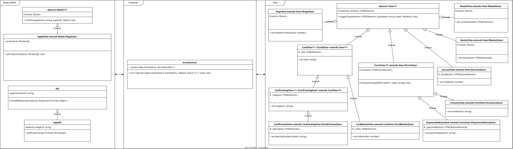
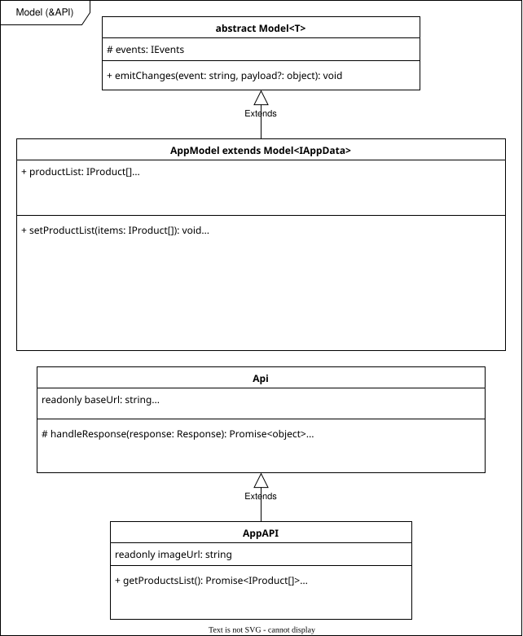
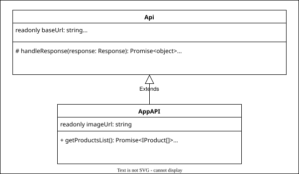
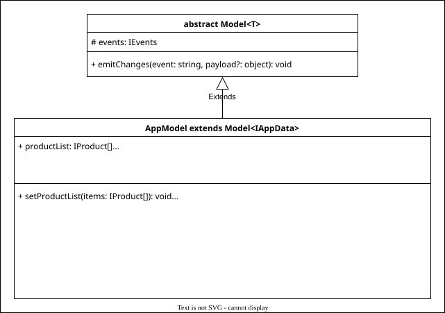
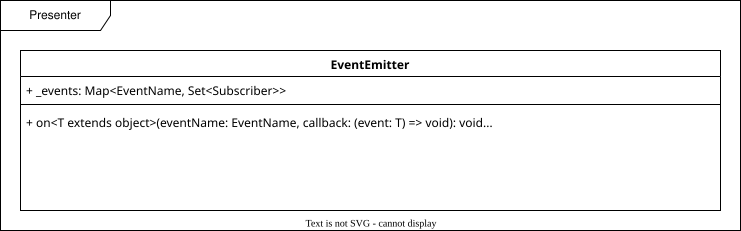
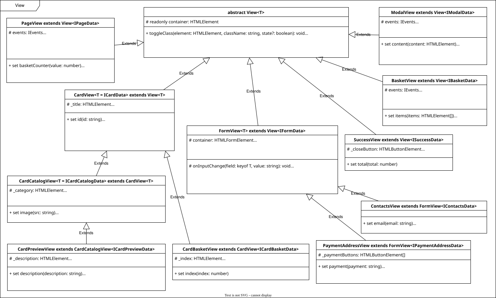
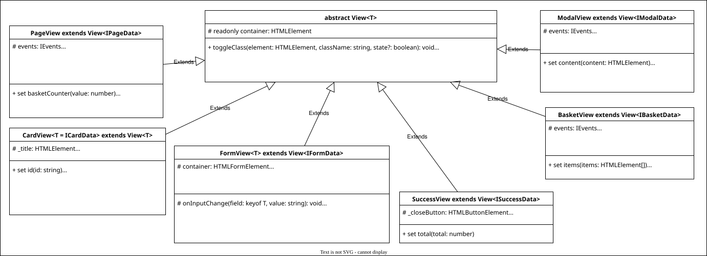
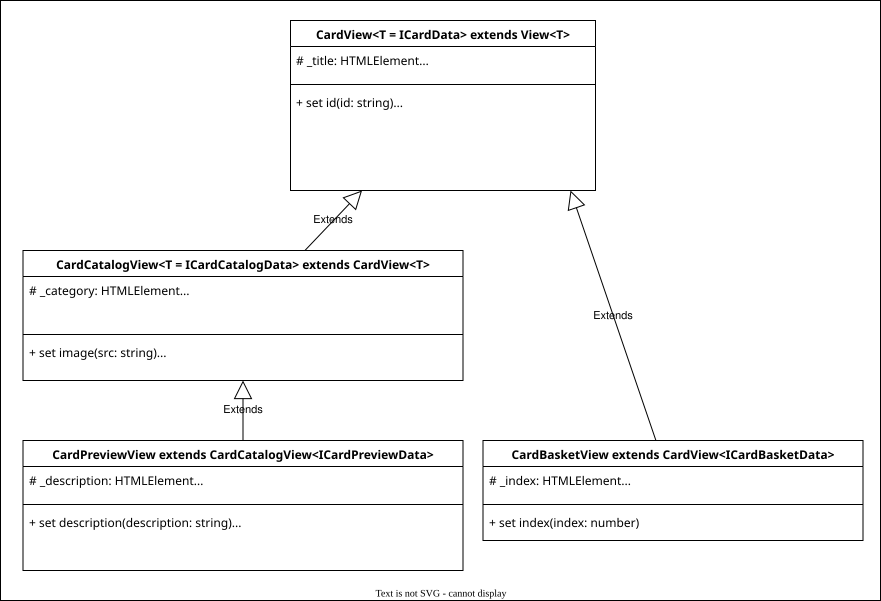
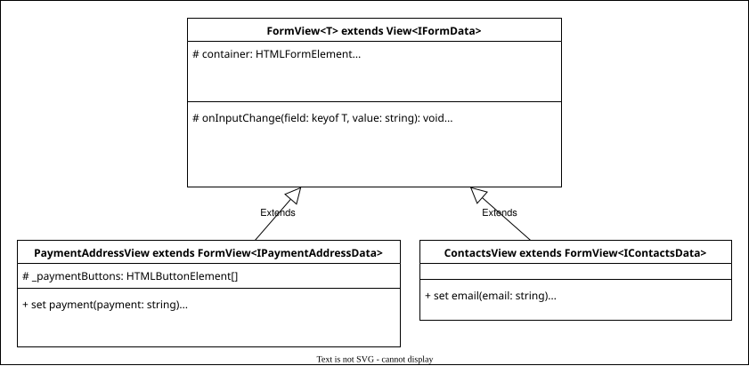

# Интернет-магазин «Web-Larek»

## Структура проекта

Структура проекта:

- src/ — исходные файлы проекта
- src/components/ — папка с JS компонентами
- src/components/base/ — папка с базовым кодом
- src/components/model/ - папка с моделями данных
- src/components/view/ - папка с компонентами отображения
- src/types/ — папка с типами

Важные файлы:

- src/pages/index.html — HTML-файл главной страницы
- src/scss/styles.scss — корневой файл стилей
- src/index.ts — точка входа приложения
- src/utils/constants.ts — файл с константами
- src/utils/utils.ts — файл с утилитами

## Архитектура

Архитектура проекта основана на применении MVP-паттерна, в котором характерно разделение кода на слои [данных (Model)](#слой-данных), [отображения (View)](#слой-отображения) и [управления (Presenter)](#слой-управления). Особенностью реализации данного паттерна является отсутствие четкой связи между моделью и отображением - их связь осуществляется через Presenter. При разработке приложения используется событийно-ориентированный подход.

Для работы приложения в `src/index.ts` создаются экземпляры основных и переиспользуемых классов приложения (экземпляры некоторых классов пересоздаются при определенных событиях внутри кода обработчиков). Данные получают с сервера с помощью методов класса AppAPI, работа с данными осуществляется методами класса AppModel. Отображение данных настраивается с помощью методов классов View. При изменении данных и отображения инициируются определенные события (часть инициирования событий заложена в методах классов). Устанавливаются слушатели и обработчики событий, связывая, таким образом, данные с отображением.

UML-схема используемых классов:



### Типы:

- `type ApiListResponse<Type>` - тип данных ответа от сервера. Включает массив данных `items` передаваемого типа `Type` и числовое значение `total` общего количества полученных элементов.
- `type ApiPostMethods` - тип определяет поддерживаемые методы запроса к серверу.
- `type EventName` - тип названия события. Название может быть представлено в виде строки или регулярного выражения для включения нескольких однотипных событий.
- `type Subscriber` - тип подписчиков на события - обработчиков. Представлен функцией.
- `type EmitterEvent` - тип структуры объекта события. Включает имя события `eventName` в виде строки и данные `data`, связанные с событием, неизвестного типа.
- `enum EventsList` - список возможных событий при работе приложения.
- `interface IProduct` - тип данных объекта товара. Включает строки идентификатора `id`, названия `title`, описания `description`, url изображения `image` товара, категорию товара `category`, определенную типом `ICategory`, цену товара `price`, представленную в числовом значении или значении типа `null` для бесценного товара, статус нахождения товара в корзине `isInBasket` в виде логического значения.
- `type ICategory` - тип определяет возможные категории товаров.
- `interface IPaymentAddressForm` - интерфейс данных формы оплаты и адреса. Включает возможные значения поля оплаты `payment` и строку адреса `address`.
- `interface IContactsForm` - интерфейс данных формы контактов. Включает строки email `email` и телефона `phone`.
- `type IOrderForm` - тип общих данных форм оформления заказа. Включает данные формы оплаты и адреса и формы контактов.
- `interface IOrder` - интерфейс заказа для отправки данных на сервер. Помимо данных форм включает массив строк идентификаторов товаров `items` и общую сумму заказа `total`.
- `interface IOrderResult` - интерфейс ответа от сервера об успешном заказе. Включает строку `id` заказа и общую сумму заказа `total`.
- `type IFormErrors` - тип сообщений ошибок валидации формы. Описывает объект с необязательными свойствами. Ключами объекта являются названия полей ввода форм заказа `IOrderForm`, в значениях приводятся строки сообщений ошибок.
- `interface IAppData` - тип передаваемых данных в модель приложения. Включает массив товаров `IProduct`, строку идентификатора товара `preview`, выбранного для показа в модальном окне, поля ввода форм оформления заказа `order`, типизированные `IOrderForm`.
- `interface IPageData` - тип передаваемых данных для отображения главной страницы сайта. Включает числовое значение счетчика количества товаров в корзине `basketCounter`, массив элементов карточек товаров `productList`, состояние блокировки страницы `locked` в логическом значении.
- `interface ICardActions` - интерфейс взаимодействий с карточкой товара. Описывает функции обработчики для слушателей событий.
- `interface ICardData` - тип передаваемых данных для отображения общих элементов карточек товара. Включает строки идентификатора `id` и названия `title`, цену товара `price`, представленную в числовом значении или значении типа `null` для бесценного товара.
- `type ICategoryNames` - тип объекта, содержащего информацию о модификаторах классов отдельных категорий. Представляет собой объект с ключами - названиями категории товара `ICategory` - и значениями - строками модификатора для каждой категории.
- `interface ICardCatalogData` - тип передаваемых данных для отображения карточки товара на главной странице. Включает строки идентификатора `id`, названия `title`, url изображения `image` товара, категорию товара `category`, определенную типом `ICategory`, цену товара `price`, представленную в числовом значении или значении типа `null` для бесценного товара.
- `interface ICardPreviewData` - тип передаваемых данных для отображения товара в модальном окне. Включает строки идентификатора `id`, названия `title`, описания `description`, url изображения `image` товара, категорию товара `category`, определенную типом `ICategory`, цену товара `price`, представленную в числовом значении или значении типа `null` для бесценного товара, статус нахождения товара в корзине `isInBasket` в виде логического значения.
- `interface ICardBasketData` - тип передаваемых данных для отображения товара в корзине. Включает строки идентификатора `id` и названия `title` товара, цену `price` и индекс `index` товара в числовом значении.
- `interface IBasketData` - тип передаваемых данных для отображения корзины. Включает массив элементов карточек товаров `items` и сумму их стоимости `total` в корзине.
- `interface IFormData` - тип передаваемых данных для отображения формы. Включает состояние валидности формы `isValid` в логическом значении и массив строк ошибок заполнения формы `errors`.
- `type IPaymentAddressData` - тип передаваемых данных для отображения формы оплаты и адреса. Идентичен типу данных `IPaymentAddressForm`.
- `type IContactsData` - тип передаваемых данных для отображения формы контактов. Идентичен типу данных `IContactsForm`.
- `interface ISuccessActions` - интерфейс взаимодействий с сообщением об успешном оформлении заказа. Описывает функции обработчики для слушателей событий.
- `interface ISuccessData` - тип передаваемых данных для отображения сообщения об успешном оформлении заказа. Включает общую сумму заказа `total` в числовом значении.
- `interface IModalData` - тип передаваемых данных для отображения модального окна. Включает элемент внутреннего контента `content`.

Также в директории `src/types` представлены интерфейсы для реализации классов, описывающие публичные поля и методы. Описание публичных и других полей и методов классов приведено далее в документации по каждому классу отдельно.

## Слой данных

Слой данных представлен следующими классами:

- [Api](#класс-api) - базовый класс для работы с сервером.
- [AppApi](#класс-appapi) - основной класс для работы с сервером проекта.
- [Model](#класс-model) - базовый класс для реализации модели данных.
- [AppModel](#класс-appmodel) - основной класс для работы с данными приложения.



### Классы работы с сервером



### Класс Api

Базовый класс предоставляет основные методы для клиент-серверного взаимодействия приложения.

```typescript
class Api {
	readonly baseUrl: string;
	protected options: RequestInit;

	constructor(baseUrl: string, options: RequestInit = {}): Api {}
	protected handleResponse(response: Response): Promise<object> {}
	get(uri: string): Promise<object> {}
	post(uri: string, data: object, method: ApiPostMethods): Promise<object> {}
}
```

Конструктор принимает аргументами строку url сервера и объект настроек запроса. Сохраняет данные в полях `baseUrl` и `options` соответственно.

Методы класса:

- `handleResponse` - защищенный метод обрабатывает ответ от сервера в формате json.
- `get` - метод получения данных с сервера. Возвращает обработанные `handleResponse` данные.
- `post` - метод отправки данных на сервер. Возвращает обработанные `handleResponse` данные. Метод отправки определяется аргументом `method`, типизированным `type ApiPostMethods`.

### Класс AppApi

Расширяет функциональность базового класса Api и предоставляет методы для взаимодействия с сервером проекта: методы для получения списка товаров и отправки заказа. Класс реализует интерфейс `IAppAPI`.

```typescript
class AppApi extends Api implements IAppAPI {
  readonly imageUrl: string;

  constructor(imageUrl: string, baseUrl: string, options?: RequestInit): IAppAPI {}
  getProductsList(): Promise<IProduct[]> {}
  getProductItem(id: string): Promise<IProduct> {}
  postOrder(order: IOrder): Promise<IOrderResult> {}
}
```

Конструктор типизирован `interface IAppAPIConstructor`. Принимает аргументами строку url сервера, строку url для загрузки изображений и объект настроек запроса. Использует родительский конструктор. Сохраняет url для формирования полных путей к изображениям в поле `imageUrl`.

Методы класса:

- `getProductsList` - метод для получения списка товаров с сервера. Возвращает промис с массивом объектов товаров. Каждый товар типизирован `interface IProduct`.
- `getProductItem` - метод для получения товара по идентификатору. Возвращает промис с объектом товара.
- `postOrder` - метод отправки заказа на сервер. Принимает объект заказа, типизированный `interface IOrder`. Возвращает промис с объектом ответа, типизированным `interface IOrderResult`.

### Классы моделей данных



### Класс Model

Базовый абстрактный класс описывает модели данных и связывает данные с событиями. Реализует интерфейс `IModel`.

```typescript
abstract class Model<T> implements IModel {
  constructor(data: Partial<T>, protected events: IEvents): IModel {}
  emitChanges(event: string, payload?: object): void {}
}
```

Конструктор типизирован `interface IModelConstructor<T>`. Принимает аргументами объект данных и объект брокера событий. Сохраняет данные - в экземпляре класса, брокер - в защищенном поле `events`.

Методы класса:

- `emitChanges` - метод инициирует событие по указанному имени с дополнительными параметрами.

### Класс AppModel

Расширяет функциональность базового класса Model и предоставляет методы для управления приложением. Данные типизированы `interface IAppData`. Класс реализует интерфейс `IAppModel`. Включает методы для получения и просмотра товаров, добавления и удаления товаров из корзины, подсчета общей стоимости, получения товаров и очистки корзины, заполнения, валидации полей ввода и очистки заказа.

```typescript
class AppModel extends Model<IAppData> implements IAppModel {
  productList: IProduct[];
  preview: string | null;
  order: Partial<IOrderForm>;
  formErrors: IFormErrors;

  setProductList(items: IProduct[]): void {}
  setPreviewProduct(item: IProduct): void {}
  addProductToBasket(item: IProduct): void {}
  removeProductFromBasket(item: IProduct): void {}
  getBasketItems(): IProduct[] {}
  getTotalPrice(): number {}
  setOrderField<T extends keyof IOrderForm>(field: T, value: IOrderForm[T]): void {}
  validateOrder(): boolean {}
  clearBasket(): void {}
  clearOrder(): void {}
}
```

Для реализации используется конструктор базового класса.

Поля класса:

- `productList` - список товаров. Типизирован массивом товаров типа `IProduct`.
- `preview` - идентификатор товара, выбранного для просмотра.
- `order` - объект данных форм оформления заказа. Типизирован `type IOrderForm`.
- `formErrors` - объект ошибок заполнения формы. Типизирован `type IFormErrors`.

Методы класса:

- `setProductList` - метод сборки каталога товаров. Инициирует событие изменения списка товаров.
- `setPreviewProduct` - метод установки выбранного товара для просмотра. Инициирует событие изменения открытой карточки.
- `addProductToBasket` - метод добавления товара в корзину. Меняет статус товаров в корзине `isInBasket`. Инициирует событие изменения корзины.
- `removeProductFromBasket` - метод удаления товара из корзины. Меняет статус товаров в корзине `isInBasket`. Инициирует событие изменения корзины.
- `getBasketItems` - метод возвращает массив товаров в корзине.
- `getTotalPrice` - метод возвращает общую стоимость всех товаров в корзине.
- `setOrderField` - метод установки значения поля ввода в данные заказа. Запускает проверку валидности формы.
- `validateOrder` - метод проверки валидности формы. Формирует объект `formErrors` и инициирует событие изменения ошибок формы.
- `clearBasket` - метод очистки корзины. Меняет статус товаров в корзине `isInBasket`, инициирует событие изменения корзины.
- `clearOrder` - метод очистки данных заказа.

## Слой управления

Слой управления включает базовый класс [EventEmitter](#класс-eventemitter) - брокер событий, реализующий событийно-ориентированный подход. Поскольку приложение небольшое, код представителя со слушателями и обработчиками событий не выделен в отдельные классы, а приведен в корневом файле `src/index.ts`.



### Класс EventEmitter

Базовый класс представляет собой брокер событий, предоставляющий методы для реализации событийно-ориентированного подхода. Класс реализует интерфейс `IEvents`. Включает методы для инициирования событий и установки обработчиков на них.

```typescript
class EventEmitter implements IEvents {
  _events: Map<EventName, Set<Subscriber>>;

  constructor(): EventEmitter {}
  on<T extends object>(eventName: EventName, callback: (event: T) => void): void {}
  off(eventName: EventName, callback: Subscriber): void {}
  emit<T extends object>(eventName: string, data?: T): void {}
  onAll(callback: (event: EmitterEvent) => void): void {}
  offAll(): void {}
  trigger<T extends object>(eventName: string, context?: Partial<T>): (event?: object) => void {}
}
```

Конструктор создает пустой объект Map с данными формата ключ-значение. В качестве ключа указывается имя события, типизированное `type EventName`. Значением является коллекция Set функций обработчиков событий, типизированных `type Subscriber`. Данные сохраняются в поле `_events`.

Методы класса:

- `on` - метод установки обработчика на событие. Принимает в аргументах имя события и функцию-обработчик для установки.
- `off` - метод удаления обработчика с события.
- `emit` - метод, позволяющий инициировать событие. Сообщает обработчикам о совершении события и передает объект данных для обработки.
- `onAll` - метод установки обработчика на все события.
- `offAll` - метод, сбрасывающий все обработчики со всех событий.
- `trigger` - метод генерации события в указанном контексте при вызове.

Возможные события определяются списком `EventsList`:

- `'products:change'` - изменены данные товаров.
- `'card:select'` - открыта карточка товара.
- `'card:add'` - товар добавлен в корзину.
- `'card:remove'` - товар удален из корзины.
- `'preview:change'` - изменена открытая карточка.
- `'basket:open'` - открыта корзина.
- `'backet:change'` - изменена корзина.
- `'order:open'` - открыта форма оплаты и адреса.
- `'order.payment:change'` - изменен способ оплаты.
- `'order.address:change'` - изменен адрес.
- `'formErrors:change'` - изменены ошибки формы.
- `'order:submit'` - открыта форма контактов.
- `'contacts.email:change'` - изменен email.
- `'contacts.phone:change'` - изменен телефон.
- `'contacts:submit'` - заказ отправлен.
- `'modal:open'` - открыто модальное окно.
- `'modal:close'` - закрыто модальное окно.

## Слой отображения

Слой отображения представлен следующими классами:

- [View](#класс-view) - базовый класс для описания компонентов интерфейса приложения.
- [PageView](#класс-pageview) - класс для отображения элементов главной страницы сайта.
- [CardView](#класс-cardview) - базовый класс для отображения карточки товара.
- [CardCatalogView](#класс-cardcatalogview) - класс для отображения карточки товара на главной странице.
- [CardPreviewView](#класс-cardpreviewview) - класс для отображения карточки товара в модальном окне.
- [CardBasketView](#класс-cardbasketview) - класс для отображения товара в корзине.
- [BasketView](#класс-basketview) - класс для отображения корзины.
- [FormView](#класс-formview) - базовый класс для отображения формы оформления заказа.
- [PaymentAddressView](#класс-paymentaddressview) - класс для отображения формы оплаты и адреса.
- [ContactsView](#класс-contactsview) - класс для отображения формы контактов.
- [SuccessView](#класс-successview) - класс для отображения сообщения успешного оформления заказа.
- [ModalView](#класс-modalview) - класс для отображения модальных окон.

Главными контейнерами для отображения других компонентов являются экземпляры классов PageView и ModalView. В компоненте главной страницы PageView располагаются компоненты карточек товаров CardCatalogView. Компонент модального окна ModalView в качестве внутреннего контента может включать компоненты карточек товаров с описанием CardPreviewView, корзины BasketView, форм оформления заказа PaymentAddressView и ContactsView, сообщения успешного оформления заказа SuccessView. В компоненте отображения корзины BasketView располагаются компоненты карточек товаров в виде краткой записи CardBasketView.



### Производные классы View



### Класс View

Базовый абстрактный класс для описания отображения пользовательского интерфейса. Реализует интерфейс `IView<T>`. Предоставляет основные методы для управления отображением.

```typescript
abstract class View<T> implements IView<T> {
  protected constructor(protected readonly container: HTMLElement): IView<T> {}
  toggleClass(element: HTMLElement, className: string, state?: boolean): void {}
  protected setImage(element: HTMLImageElement, src: string, alt?: string): void {}
  protected setTextContent(element: HTMLElement, value: unknown): void {}
  setDisabled(element: HTMLElement, state: boolean): void {}
  render(data?: Partial<T>): HTMLElement {}
}
```

Защищенный конструктор типизирован `interface IViewConstructor<T>`. Принимает аргументом контейнер элемента `HTMLElement` для отображения данных и сохраняет в одноименное защищенное поле `container`.

Методы класса:

- `toggleClass` - метод переключения класса `className` для элемента `element`.
- `setImage` - защищенный метод устанавливает url изображения `src` и альтернативный текст `alt` в указанный элемент `element`.
- `setTextContent` - защищенный метод устанавливает текстовое содержимое `value` для указанного элемента `element`.
- `setDisabled` - метод для переключения атрибута `disabled` в соответствии с указанным состоянием `state` для элемента `element`.
- `render` - метод отрисовки компонентов приложения в соответствии с передаваемыми данными `data`. Возвращает элемент с обновленными свойствами.

### Класс PageView

Расширяет базовый класс View и предоставляет методы для отображения элементов главной страницы сайта. Данные типизированы `interface IPageData`. Класс реализует интерфейс `IPageView`. Включает методы для обновления счетчика товаров в корзине, замены каталога товаров и переключения блокировки страницы при открытии и закрытии модального окна.

```typescript
class PageView extends View<IPageData> implements IPageView {
  protected _basketCounter: HTMLElement;
  protected _productsList: HTMLElement;
  protected _wrapper: HTMLElement;
  protected _basket: HTMLButtonElement;

  constructor(container: HTMLElement, protected events: IEvents): IPageView {}
  set basketCounter(value: number) {}
  set productsList(items: HTMLElement[]) {}
  set locked(state: boolean) {}
}
```

Конструктор типизирован `interface IPageViewConstructor`. Принимает аргументами контейнер элементов страницы и объект событий типа `IEvents` для взаимодействия c другими компонентами. В реализации использует родительский конструктор. Сохраняет объект событий в защищенное поле `events`. Также в конструкторе производится поиск изменяющихся элементов и сохранение их в защищенные поля класса. Назначает обработчик события кнопке для открытия корзины.

Поля класса:

- `_basketCounter` - защищенное поле элемента счетчика корзины.
- `_productsList` - защищенное поле элемента контейнера для карточек товара.
- `_wrapper` - защищенное поле элемента обертки главной страницы для блокировки при работе с модальными окнами.
- `_basket` - защищенное поле элемента `<button>` кнопки для открытия корзины.

Методы класса:

- `set basketCounter` - сеттер для обновления счетчика корзины в соответствии с переданным значением `value`.
- `set productsList` - сеттер для обновления каталога товаров на главной странице в соответствии с переданным массивом элементов `items`.
- `set locked` - сеттер для переключения блокировки страницы в соответствии с переданным состоянием `state`.

### Классы отображения карточек товаров



### Класс CardView

Расширяет базовый класс View и предоставляет методы для отображения общих элементов информации о товаре. Данные типизированы `interface ICardData`. Класс реализует интерфейс `ICardView`. Включает методы для обновления и получения данных о товаре: идентификатор, название, цена.

```typescript
class CardView<T = ICardData> extends View<T> implements ICardView {
  protected _title: HTMLElement;
  protected _price: HTMLElement;

  constructor(container: HTMLElement): ICardView {}
  set id(id: string) {}
  get id(): string {}
  set title(title: string) {}
  get title(): string {}
  set price(price: number | null) {}
  get price(): number | null {}
}
```

Конструктор типизирован `interface ICardViewConstructor`. Принимает аргументами контейнер элементов информации о товаре. В реализации использует родительский конструктор. Также в конструкторе класса производится поиск элементов карточки товара и сохранение их в защищенные поля класса.

Поля класса:

- `_title` - защищенное поле элемента названия товара.
- `_price` - защищенное поле элемента цены товара.

Методы класса:

- `set id` - сеттер для установки идентификатора товара в data-атрибут элемента контейнера.
- `get id` - геттер для получения идентификатора товара из data-атрибута элемента контейнера.
- `set title` - сеттер для установки названия товара в качестве текстового контента в элемент `_title`.
- `get title` - геттер для получения названия товара из текстового контента элемента `_title`.
- `set price` - сеттер для установки цены товара в качестве текстового контента в элемент `_price`. В случае если цена товара равна `null`, устанавливается значение `Бесценно`.
- `get price` - геттер для получения цены товара из текстового контента элемента `_price`.

### Класс CardCatalogView

Расширяет базовый класс CardView и предоставляет методы для отображения элементов информации о товаре на главной странице сайта. Данные типизированы `interface ICardCatalogData`. Класс реализует интерфейс `ICardCatalogView`. Включает методы для обновления url изображения и категории товара.

```typescript
class CardCatalogView<T = ICardCatalogData> extends CardView<T> implements ICardCatalogView {
  protected _category: HTMLElement;
  protected _image: HTMLImageElement;
  static categories: ICategoryNames;

  constructor(container: HTMLElement, actions?: ICardActions): ICardCatalogView {}
  set image(src: string) {}
  set category(category: ICategory) {}
}
```

Конструктор типизирован `interface ICardCatalogViewConstructor`. Принимает аргументами контейнер элементов информации о товаре и объект типа `ICardActions` для передачи колбэка слушателю события. В реализации использует родительский конструктор. Также в конструкторе класса производится поиск элементов карточки товара и сохранение их в защищенные поля класса. Назначает обработчик события контейнеру для открытия карточки товара в модальном окне.

Поля класса:

- `_category` - защищенное поле элемента категории товара.
- `_image` - защищенное поле элемента `` изображения товара.
- `categories` - статическое поле объекта категорий товара для формирования названия класса по bem. Типизировано `type ICategoryNames`. Представляет собой объект с ключами - названиями категории товара - и значениями - строками модификатора для каждой категории.

Методы класса:

- `set image` - сеттер для установки url изображения товара в элемент `_image`.
- `set category` - сеттер для установки категории товара в качестве текстового контента в элемент `_category` и добавление класса элемента с модификатором категории.

### Класс CardPreviewView

Расширяет класс CardCatalogView и предоставляет методы для отображения элементов информации о товаре в модальном окне. Данные типизированы `interface ICardPreviewData`. Класс реализует интерфейс `ICardPreviewView`. Включает методы для обновления описания, цены товара и его статуса добавления в корзину.

```typescript
class CardPreviewView extends CardCatalogView<ICardPreviewData> implements ICardPreviewView {
  protected _description: HTMLElement;
  protected _button: HTMLButtonElement;

  constructor(container: HTMLElement, actions?: ICardActions): ICardPreviewView {}
  set description(description: string) {}
  set price(price: number | null) {}
  set isInBasket(state: boolean) {}
}
```

Конструктор типизирован `interface ICardPreviewViewConstructor`. Принимает аргументами контейнер элементов информации о товаре и объект для передачи колбэка слушателю события. В реализации использует родительский конструктор. Также в конструкторе производится поиск дополнительных элементов карточки товара для отображения в модальном окне и сохранение их в защищенные поля класса. Назначает обработчик события кнопке для добавления товара в корзину.

Поля класса:

- `_description` - защищенное поле элемента описания товара.
- `_button` - защищенное поле элемента `<button>` кнопки покупки товара.

Методы класса:

- `set description` - сеттер для установки описания товара в качестве текстового контента в элемент `_description`.
- `set price` - переназначенный сеттер для установки цены товара в качестве текстового контента в элемент `_price`. В случае если цена товара равна `null`, устанавливается значение `Бесценно` и блокируется кнопка покупки товара.
- `set isInBasket` - сеттер для установки текстового контента кнопки `_button` в зависимости от нахождения товара в корзине.

### Класс CardBasketView

Расширяет класс CardView и предоставляет методы для отображения элементов информации о товаре в корзине. Данные типизированы `interface ICardBasketData`. Класс реализует интерфейс `ICardBasketView`. Включает метод для обновления индекса товара в корзине.

```typescript
class CardBasketView extends CardView<ICardBasketData> implements ICardBasketView {
  protected _index: HTMLElement;
  protected _button: HTMLButtonElement;

  constructor(container: HTMLElement, actions?: ICardActions): ICardBasketView {}
  set index(index: number) {}
}
```

Конструктор типизирован `interface ICardBasketViewConstructor`. Принимает аргументами контейнер для размещения элементов информации о товаре и объект для передачи колбэка слушателю события. В реализации использует родительский конструктор. Также в конструкторе производится поиск дополнительных элементов карточки товара для отображения в корзине и сохранение их в защищенные поля класса. Назначает обработчик события кнопке для удаления товара из корзины.

Поля класса:

- `_index` - защищенное поле элемента индекса товара.
- `_button` - защищенное поле элемента `<button>` кнопки удаления товара из корзины.

Методы класса:

- `set index` - сеттер для установки индекса товара в качестве текстового контента в элемент `_index`.

### Класс BasketView

Расширяет базовый класс View и предоставляет методы для отображения элементов корзины. Данные типизированы `interface IBasketData`. Класс реализует интерфейс `IBasketView`. Включает методы для обновления карточек товаров в корзине и общей стоимости заказа.

```typescript
class BasketView extends View<IBasketData> implements IBasketView {
  protected _list: HTMLElement;
  protected _total: HTMLElement;
  protected _button: HTMLButtonElement;

  constructor(container: HTMLElement, protected events: IEvents): IBasketView {}
  set items(items: HTMLElement[]) {}
  set total(total: number) {}
}
```

Конструктор типизирован `interface IBasketViewConstructor`. Принимает аргументами контейнер элементов корзины и объект событий типа `IEvents` для взаимодействия c другими компонентами. В реализации использует родительский конструктор. Сохраняет объект событий в защищенное поле `events`. Также в конструкторе производится поиск изменяющихся элементов и сохранение их в защищенные поля класса. Назначает обработчик события кнопке для перехода к оформлению заказа.

Поля класса:

- `_list` - защищенное поле элемента контейнера для карточек товаров в корзине.
- `_total` - защищенное поле элемента общей стоимости товаров в корзине.
- `_button` - защищенное поле элемента `<button>` кнопки оформления заказа.

Методы класса:

- `set items` - сеттер для обновления товаров в корзине в соответствии с переданным массивом элементов `items`.
- `set total` - сеттер для обновления общей стоимости товаров корзины в соответствии с переданным значением `total`.

### Классы отображения форм



### Класс FormView

Расширяет базовый класс View и предоставляет методы для работы с элементами формы оформления заказа, в том числе с ошибками заполнения и кнопкой отправки формы. Данные типизированы `interface IFormData`. Класс реализует интерфейс `IFormView<T>`. Включает методы для обновления ошибок формы, блокировки кнопки отправки, инициирования события заполнения полей формы и очистки формы.

```typescript
class FormView<T> extends View<IFormData> implements IFormView<T> {
  protected _submitButton: HTMLButtonElement;
  protected _errors: HTMLElement;

  constructor(protected container: HTMLFormElement, protected events: IEvents): IFormView<T> {}
  protected onInputChange(field: keyof T, value: string): void {}
  set isValid(state: boolean) {}
  set errors(errors: string) {}
  clearForm(): void {}
  render(state: Partial<T> & IFormData): HTMLFormElement {}
}
```

Конструктор типизирован `interface IFormViewConstructor<T>`. Принимает аргументами контейнер - элемент формы `<form>` и объект событий типа `IEvents` для взаимодействия c другими компонентами. В реализации использует родительский конструктор. Сохраняет объект событий в защищенное поле `events`. Также в конструкторе класса производится поиск элементов формы и сохранение их в защищенные поля класса. Назначает обработчики события форме при изменении ее полей ввода и отправке.

Поля класса:

- `_submitButton` - защищенное поле элемента `<button>` кнопки отправки формы.
- `_errors` - защищенное поле элемента ошибок заполнения полей формы.

Методы класса:

- `onInputChange` - защищенный метод инициирования события заполнения полей формы.
- `set isValid` - сеттер для переключения блокировки кнопки отправки в соответствии с переданным состоянием `state`.
- `set errors` - сеттер для установки ошибок формы в качестве текстового контента в элемент `_errors`.
- `clearForm` - метод очистки формы.
- `render` - переопределенный метод для отрисовки формы в соответствии с переданным состоянием `state`, типизированным с учетом данных формы `IFormData`. Использует родительский метод. Возвращает элемент формы `<form>` с обновленными свойствами.

### Класс PaymentAddressView

Расширяет класс FormView и предоставляет методы для работы с элементами формы оплаты и адреса. Данные типизированы `type IPaymentAddressData`. Класс реализует интерфейс `IPaymentAddressView`. Включает методы для обновления адреса доставки, переключения способа оплаты товара.

```typescript
class PaymentAddressView extends FormView<IPaymentAddressData> implements IPaymentAddressView {
  protected _paymentButtons: HTMLButtonElement[];

  constructor(container: HTMLFormElement, events: IEvents): IPaymentAddressView {}
  set payment(payment: string) {}
  set address(address: string) {}
  clearForm(): void {}
}
```

Конструктор типизирован `interface IPaymentAddressViewConstructor`. Принимает аргументами контейнер - элемент формы и объект событий. В реализации использует родительский конструктор. Также в конструкторе класса производится поиск кнопок способов оплаты заказа и сохранение их в защищенное поле класса. Назначает обработчики события кнопкам для переключения способа оплаты.

Поля класса:

- `_paymentButtons` - защищенное поле массива элементов кнопок `<button>` способов оплаты заказа.

Методы класса:

- `set payment` - сеттер для переключения кнопок способов оплаты `_paymentButtons` в соответствии с переданным значением `payment`.
- `set address` - сеттер для установки передаваемого адреса доставки заказа `address` в качестве значения соответствующего поля ввода.
- `clearForm` - переопределенный метод очистки формы. Сбрасывает активное состояние кнопок способов оплаты.

### Класс ContactsView

Расширяет класс FormView и предоставляет методы для работы с элементами формы контактов. Данные типизированы `type IContactsData`. Класс реализует интерфейс `IContactsView`. Включает методы для обновления email и телефона.

```typescript
class ContactsView extends FormView<IContactsData> implements IContactsView {
  constructor(container: HTMLFormElement, events: IEvents): IContactsView {}
  set email(email: string) {}
  set phone(phone: string) {}
}
```

Конструктор типизирован `interface IContactsViewConstructor`. Принимает аргументами контейнер - элемент формы и объект событий. Для реализации использует родительский конструктор.

Методы класса:

- `set email` - сеттер для установки передаваемого email `email` в качестве значения соответствующего поля ввода.
- `set phone` - сеттер для установки передаваемого номера телефона `phone` в качестве значения соответствующего поля ввода.

### Класс SuccessView

Расширяет базовый класс View и предоставляет методы для отображения элементов сообщения об успешном оформлении заказа. Данные типизированы `interface ISuccessData`. Класс реализует интерфейс `ISuccessView`. Включает метод для обновления суммы заказа.

```typescript
class SuccessView extends View<ISuccessData> implements ISuccessView {
  protected _closeButton: HTMLButtonElement;
  protected _total: HTMLElement;

  constructor(container: HTMLElement, actions: ISuccessActions): ISuccessView {}
  set total(total: number) {}
}
```

Конструктор типизирован `interface ISuccessViewConstructor`. Принимает аргументами контейнер элементов сообщения и объект типа `ISuccessActions` для передачи колбэка слушателю события. В реализации использует родительский конструктор. Также в конструкторе класса производится поиск изменяющихся элементов сообщения и сохранение их в защищенные поля класса. Назначает обработчик события кнопке для закрытия модального окна.

Поля класса:

- `_closeButton` - защищенное поле элемента кнопки `<button>` для закрытия модального окна с сообщением.
- `_total` - защищенное поле элемента суммы оформленного заказа.

Методы класса:

- `set total`- сеттер для установки суммы заказа в качестве текстового контента в элемент `_total`.

### Класс ModalView

Расширяет базовый класс View и предоставляет методы для отображения элементов модального окна. Данные типизированы `interface IModalData`. Класс реализует интерфейс `IModalView`. Включает методы для обновления внутреннего контента, открытия и закрытия модального окна.

```typescript
class ModalView extends View<IModalData> implements IModalView {
  protected _closeButton: HTMLButtonElement;
  protected _content: HTMLElement;

  constructor(container: HTMLElement, protected events: IEvents): IModalView {}
  set content(content: HTMLElement) {}
  open(): void {}
  close(): void {}
  render(data: IModalData): HTMLElement {}
}
```

Конструктор типизирован `interface IModalViewConstructor`. Принимает аргументами контейнер элементов модального окна и объект событий типа `IEvents` для взаимодействия c другими компонентами. В реализации использует родительский конструктор. Сохраняет объект событий в защищенное поле `events`. Также в конструкторе класса производится поиск элементов модального окна и сохранение их в защищенные поля класса. Назначает обработчики события кнопке для закрытия модального окна и контейнеру для закрытия модального окна кликом на оверлей.

Поля класса:

- `_closeButton` - защищенное поле элемента кнопки `<button>` для закрытия модального окна.
- `_content` - защищенное поле элемента контейнера внутреннего контента модального окна.

Методы класса:

- `set content` - сеттер для установки контента модального окна в качестве дочернего элемента в элемент `_content`.
- `open` - метод открытия модального окна. Добавляет окну класс с модификатором `_active` и инициирует событие открытия окна.
- `close` - метод закрытия модального окна. Удаляет с окна класс с модификатором `_active`, обнуляет контент `_content` и инициирует событие закрытия окна.
- `render` - переопределенный метод для отрисовки модального окна с соответствии с переданным элементом внутреннего контента. Использует родительский метод. Вызывает метод открытия модального окна. Возвращает элемент контейнера с обновленными свойствами.
